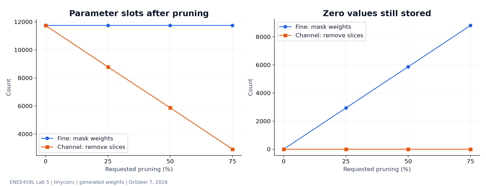
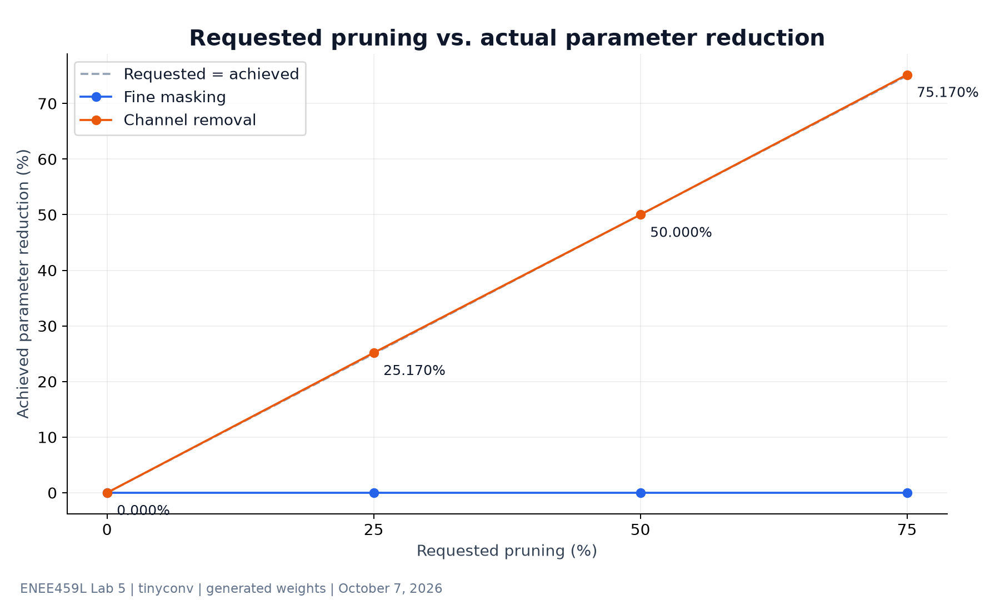
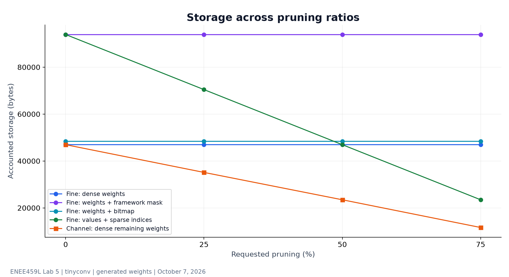
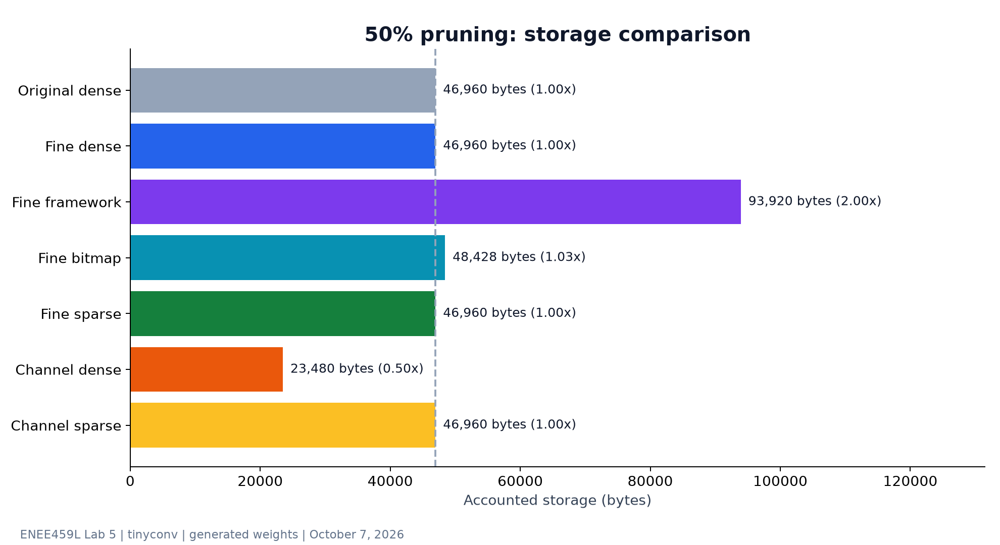
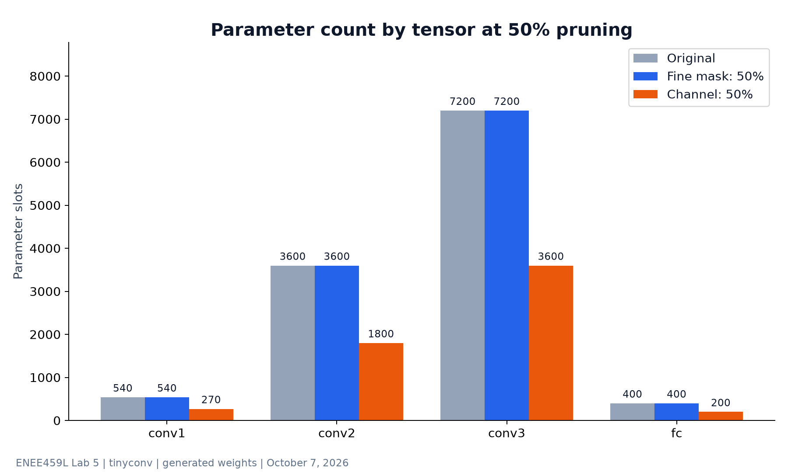
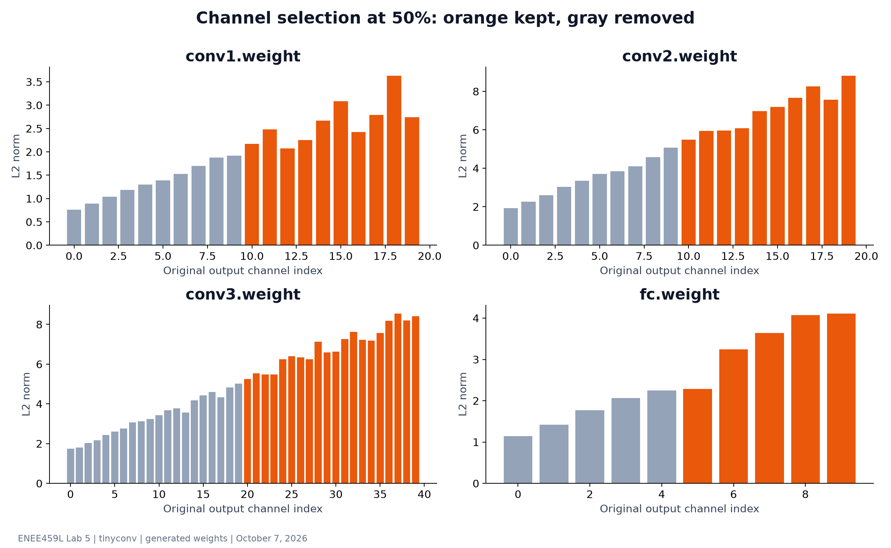
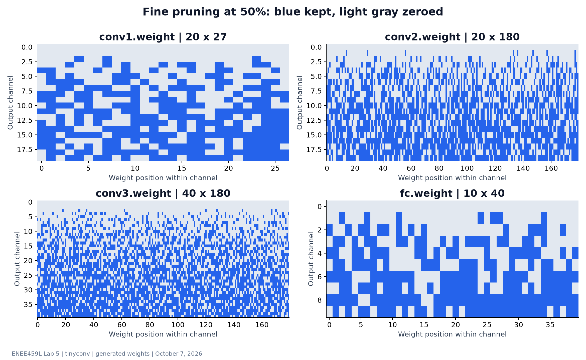
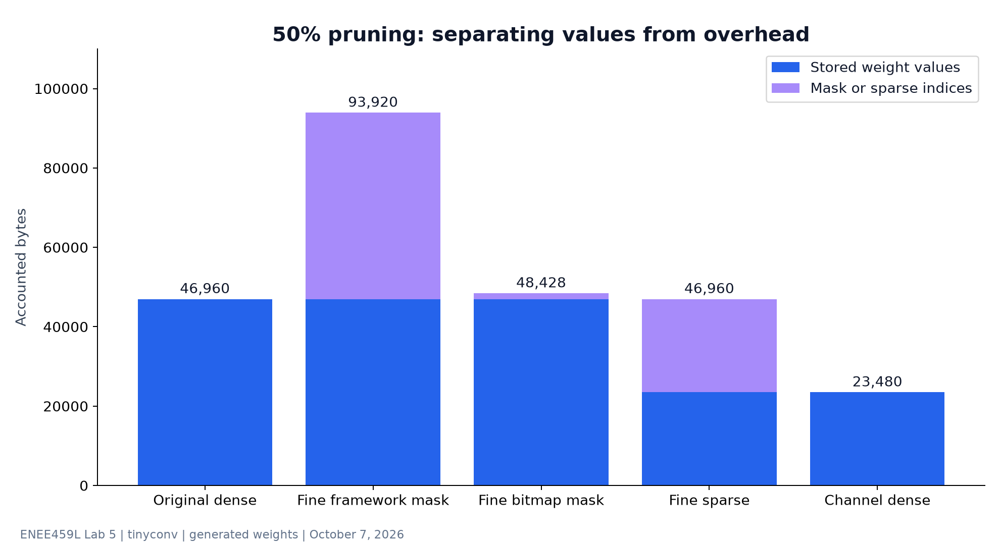

# Lab 5 chart bundle

All eight charts use the verified tinyconv report. Each chart is provided as
PNG and vector SVG. Open index.html locally for the full illustrated report.
GitHub renders this Markdown overview; it does not directly render HTML pages.

- [Download complete bundle](../lab05-chart-bundle.zip)
- [Sweep data](sweep-results.csv)
- [Complete output](prune_outputs.json)

The original model has 11,740 parameters and 46,960 FP32 bytes. At 50%,
masking retains the shape and all parameter slots, whereas channel removal
halves the slots and dense storage. Framework masks add a second dense tensor;
sparse indices can offset the savings from zero weights.

## Reproduce the charts

From lab05 (plotting dependencies are optional for the lab itself):

    python3 -m pip install -r requirements-charts.txt
    python3 main.py
    python3 build_charts.py

The output sweep is used directly. Extra storage-series points are calculated
with the tested pruning functions and the same generated tensors.
Storage excludes container overhead and sparse row pointers. No model accuracy
or inference speed was measured. Channel pruning is tensor-by-tensor and does
not establish a runnable network with compatible downstream input shapes.

## Parameter slots and stored zeros

[Vector SVG](01-parameters-and-zeros.svg)

## Requested versus achieved reduction

[Vector SVG](02-requested-vs-achieved.svg)

## Storage across pruning ratios

[Vector SVG](03-storage-sweep.svg)

## Storage comparison at 50% pruning

[Vector SVG](04-storage-at-50-percent.svg)

## Parameters by tensor

[Vector SVG](05-layer-parameters.svg)

## Channel norms and retained channels

[Vector SVG](06-channel-importance.svg)

## Fine-pruning mask maps

[Vector SVG](07-fine-mask-map.svg)

## Weight values versus representation overhead

[Vector SVG](08-storage-breakdown.svg)

